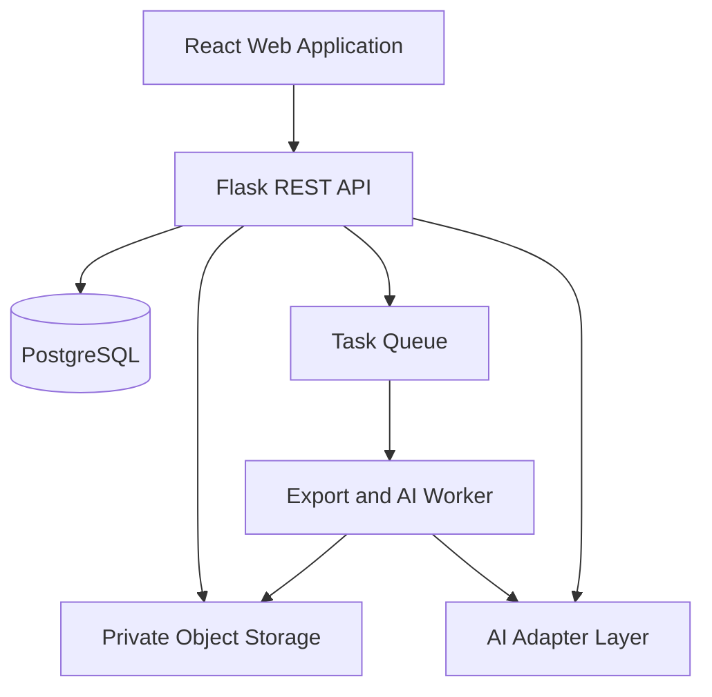

# 🌌 TENTORA: Master Project Report

> **TENTORA** is an AI-powered, curated creative-solutions platform that connects project needs, Ready Designs, visual taste, and human creative expertise through one organized experience.

---

## 📌 Document Status

| Field | Value |
| :--- | :--- |
| **Document Type** | Master Product, Business, Technical, Implementation & Closure Report |
| **Coverage** | Stages 1–5 |
| **Status** | Integrated Project Baseline |
| **Implementation Outcomes** | Pending Verified Evidence |
| **Primary Audience** | Project Owner, Development Team, Creative Partners, Advisors, Reviewers & Funding Evaluators |

> [!IMPORTANT]
> This report consolidates the five TENTORA stages. It does not replace the detailed stage documents or claim that planned features have already been implemented.

### Status Definitions

| Status | Meaning |
| :--- | :--- |
| **Approved Direction** | A product principle established across the project documents. |
| **Proposed** | A recommended approach requiring approval or validation. |
| **Pending Evidence** | Planned or potentially implemented, but not yet proven. |
| **Open Decision** | A decision that materially affects scope, cost, rights, or implementation. |

---

## 📚 Source Documents

| Stage | Document | Purpose |
| :---: | :--- | :--- |
| **1** | Idea Development | Defines and evaluates the product concept. |
| **2** | Project Charter | Establishes scope, stakeholders, requirements, and acceptance direction. |
| **3** | Technical Documentation | Defines architecture, database, APIs, and technical rules. |
| **4** | MVP Development & Execution | Organizes implementation, sprints, QA, risks, and evidence. |
| **5** | Project Closure & Handover | Defines final verification, handover, and closure conditions. |

---

# 1. Executive Conclusion

TENTORA is a viable and differentiated creative-technology concept, but its success depends on disciplined execution rather than the number of features.

Project owners may understand the creative outcome they need but struggle to:

- Identify the correct creative service.
- Express their visual taste.
- Find a compatible creative professional.
- Maintain consistency across multiple services.
- Organize communication and delivery.

TENTORA addresses this problem through two connected paths:

### 🎨 Design Now

A fast self-service path using curated, creator-authored Ready Designs that clients customize only through approved properties.

### 🤝 Work With a Creative

A guided path that converts visual preferences into one Main Taste Profile and recommends no more than six compatible creatives, studios, or teams.

The core innovation is not that **AI creates art**.

The core innovation is that AI helps:

- Interpret creative needs.
- Structure visual taste.
- Support controlled customization.
- Improve creative matching.
- Maintain consistency.
- Organize professional handoff.

Human creatives retain authorship, ownership, and professional judgment.

### Recommended Decision

Proceed with a controlled MVP under four conditions:

1. Validate the most important assumptions with real clients and creatives.
2. Build one complete vertical slice for each product path.
3. Secure creative rights and permissioned content before publishing.
4. Treat all performance and adoption targets as proposed until measured.

---

# 2. The Problem

## 2.1 Client Problem

Project owners commonly face five connected difficulties:

- They understand their business need but may not know the correct creative service.
- They browse many portfolios without knowing which style is suitable.
- They struggle to express visual taste in a written brief.
- Multi-service projects become fragmented across creatives and platforms.
- Files, messages, feedback, approvals, and delivery become difficult to track.

## 2.2 Creative Problem

Creatives also face structural problems:

- Opportunities may not match their actual style or experience.
- Portfolio discovery often rewards popularity rather than relevance.
- Repetitive enquiries consume time before project fit is understood.
- Reusable designs lack a controlled licensing and commercialization model.
- Attribution, modification limits, AI permissions, and compensation may be unclear.

## 2.3 Market Hypothesis

The project hypothesis is that clients do not need another unlimited freelance marketplace or generic template library.

They need a curated route from their project sector and creative need to a suitable and usable result.

> This hypothesis must be validated through interviews, usability testing, partner interest, and pilot transactions.

---

# 3. Product Definition

TENTORA combines:

- Sector-led creative discovery.
- Creative services explained through visual work.
- Curated creative portfolios.
- Creator-authored Ready Designs.
- Controlled customization.
- AI-assisted discovery.
- Visual Taste Discovery.
- One reusable Main Taste Profile.
- Structured Creative DNA.
- Explainable matching.
- A connected project workspace.
- Rights, licensing, attribution, and handoff records.

## Product Boundaries

TENTORA is not:

- A conventional open freelance marketplace.
- A high-volume generic template library.
- A blank-canvas AI design generator.
- An AI replacement for artists or designers.
- An unlimited recommendation feed.
- A generic SaaS dashboard.

---

# 4. Target Users

| User Group | Need | TENTORA Response |
| :--- | :--- | :--- |
| **Project Owners** | Reach a suitable result without understanding every creative discipline. | Sector-led discovery and guided product paths. |
| **SMEs & Emerging Brands** | Obtain coordinated creative work with less searching. | Multi-service projects, matching, and workspace. |
| **Clients With Urgent Needs** | Produce a usable design quickly. | Ready Design customization and export. |
| **Clients Requiring Original Work** | Find a suitable professional. | Taste Discovery and explainable matching. |
| **Independent Creatives** | Receive relevant opportunities and monetize reusable work. | Creative DNA, projects, licensing, and attribution. |
| **Studios & Teams** | Cover projects requiring several services. | Multi-service coverage and team recommendations. |
| **Curators & Administrators** | Maintain quality, rights, and trusted information. | Review, publication, moderation, and audit controls. |

---

# 5. Initial Target Sectors

| # | Sector | Example Creative Needs |
| :---: | :--- | :--- |
| 1 | **Restaurants & Cafés** | Identity, menus, packaging, social content, displays, websites, staff products, and artwork. |
| 2 | **Real Estate & Development** | Branding, brochures, renders, campaigns, signage, and marketing content. |
| 3 | **Events & Occasions** | Event identity, invitations, signage, decorative visuals, photography, and motion. |
| 4 | **Exhibitions & Conferences** | Booth graphics, presentations, digital screens, signage, and print materials. |
| 5 | **E-commerce** | Identity, packaging, product imagery, storefronts, campaigns, and social content. |

The sectors are structured entry points rather than random categories.

Services may overlap, but their visual examples and language should reflect each sector’s context.

> All five sectors will be visible and clickable. **Restaurants & Cafés** is the first complete functional pilot.

---

# 6. End-to-End Product Experience

## 6.1 Shared Entry

`Sector → Service → Visual Examples → Choose Product Path`

Starting with a sector reduces the need for clients to understand specialist creative terminology.

## 6.2 Path A — Design Now

`Sector → Service → Ready Design → Controlled Customization → Preview → Save or Export`

The creator defines the properties that may be changed, including:

- Text and content.
- Approved colors.
- Font choices.
- Images and image treatments.
- Layout variations.
- Dimensions.
- Export formats.
- Controlled repeated content such as menu items.

AI may assist with approved actions such as:

- Content rewriting.
- Translation.
- Background removal.
- Color suggestions.
- Image cleanup.
- Content arrangement.
- Format adaptation.

Every AI action must remain inside the Ready Design rules.

## 6.3 Path B — Work With a Creative

`Sector → Select Services → Taste Discovery → Main Taste Profile → Up to Six Recommendations → Selection → Workspace → Delivery`

The user completes one visual test for the entire project.

The Main Taste Profile may represent:

- Style.
- Mood.
- Color.
- Composition.
- Materials.
- Shape language.
- Artistic direction.

## 6.4 Connected Handoff

`Saved Ready Design → Continue With a Creative → Transfer Design Context → Professional Development`

The handoff preserves:

- Ready Design ID and version.
- Editable-property values.
- Client content.
- Uploaded assets.
- Preview references.
- AI-assisted actions.
- Creator attribution.
- License reference.
- Structured summary of client choices.

The user continues the same journey without restarting the brief.

---

# 7. Taste Discovery & Creative DNA

## Main Taste Profile

The Main Taste Profile is generated from curated visual selections and reviewed style tags.

It is:

- Reusable across one project.
- Understandable to the client.
- Adjustable for a specific service.
- A decision-support tool.

> It must not be presented as a psychological diagnosis or a scientifically perfect measurement of personal taste.

## Creative DNA

Creative DNA represents a creative’s demonstrated style and capability using:

- Approved portfolio work.
- Services offered.
- Visual tags.
- Sector experience.
- Creative medium.
- Multi-service capability.
- Curation status.
- Studio or team capability.

Creatives should be able to review how their work is represented.

## Explainable Matching

The initial matching system may consider:

- Required-service coverage.
- Taste similarity.
- Sector relevance.
- Portfolio evidence.
- Verified availability.
- Multi-service capability.
- Team compatibility.

The system must return no more than six options and explain why each option is relevant.

---

# 8. Artificial Intelligence Strategy

## Appropriate AI Responsibilities

| Capability | AI Responsibility |
| :--- | :--- |
| **Intent Interpretation** | Understand sector, service, format, style, and likely next action. |
| **Ready Design Discovery** | Retrieve and rank permissioned designs. |
| **Controlled Customization** | Assist only with approved properties. |
| **Taste Structuring** | Convert visual selections into weighted preferences. |
| **Creative Matching** | Compare project needs with Creative DNA. |
| **Consistency Support** | Maintain direction across multiple services. |
| **Professional Handoff** | Convert saved client activity into a structured brief. |

## AI Guardrails

- AI cannot modify properties outside the Ready Design schema.
- Users must preview material changes.
- Portfolios cannot be used for model training without explicit consent.
- AI actions and results should be logged.
- Failed actions require a safe fallback.
- Internal scores must not be presented as guarantees.
- Human creatives retain authorship.

## Innovation Claim

TENTORA’s technical innovation is the orchestration of:

- Visual taste.
- Creative evidence.
- Controlled design adaptation.
- Explainable matching.
- Professional project continuity.

The credible claim is not that one individual algorithm is unprecedented, but that the components work together to solve a creative-production problem.

---

# 9. Human Creativity, Rights & Trust

Every published Ready Design must include:

- Verified creator identity.
- Ownership information.
- Source-asset records.
- Editable and locked properties.
- Permitted AI actions.
- Prohibited AI actions.
- License type.
- Commercial-use terms.
- Attribution requirements.
- Compensation model.
- Design-version history.
- License-version history.
- Separate AI-training consent when applicable.

> [!CAUTION]
> Publication must be blocked when mandatory rights information is incomplete.

Historical exports, sessions, and licenses must remain traceable if a design is later unpublished.

---

# 10. Brand & Experience Direction

The name **TENTORA** combines:

- **Tentacle:** Multiple connected creative capabilities working toward one project vision.
- **Aurora:** Color, movement, diversity, and artistic wonder.

## Visual Direction

The brand may use:

- Flexible connecting lines.
- Controlled movement.
- Selective fields of color.
- Modular visual clusters.
- Relationships between creative projects.
- Editorial typography.
- Asymmetric but controlled layouts.

The brand should avoid:

- Literal octopus illustrations.
- Full-interface rainbow gradients.
- Generic SaaS dashboard styling.
- Excessive glassmorphism.
- Decorative effects without purpose.

## Experience Principles

- Artistic and expressive.
- Contemporary and memorable.
- Simple for non-designers.
- Led by authentic creative work.
- Neutral enough for portfolio imagery to provide the color.
- Clear calls to action.
- Restrained micro-interactions.
- Arabic RTL support with an English option.
- Mobile responsive.
- Keyboard accessible.
- Compatible with reduced-motion preferences.

---

# 11. Value Proposition & Differentiation

| Alternative | Common Limitation | TENTORA Distinction |
| :--- | :--- | :--- |
| **Freelance Marketplace** | Large lists and manual comparison. | Curated recommendations capped at six. |
| **Template Library** | Fast result without professional continuation. | Creator-authored designs with professional handoff. |
| **Generative AI Tool** | Unclear authorship and inconsistent art direction. | AI operates within creator-defined rules. |
| **Creative Agency** | Professional but potentially slower or less accessible. | Two paths for urgent and custom needs. |
| **Project-Management Tool** | Organizes work only after finding a creative. | Connects discovery, matching, handoff, and delivery. |

---

# 12. Business & Revenue Logic

Potential revenue streams include:

- Ready Design licensing.
- Ready Design customization fees.
- Commission on custom creative projects.
- Managed project-coordination fees.
- Future creator or studio tools.
- Recurring plans for clients with repeated creative needs.

Before implementing payments, TENTORA must define:

- Who pays.
- When payment occurs.
- The outcome being purchased.
- Platform commission or fees.
- Creator compensation.
- Settlement process.
- Refund and cancellation policies.
- Revision and dispute rules.
- Saudi tax and invoicing requirements.
- Consumer and e-commerce requirements.
- Whether payments are included in the MVP.

> The MVP should validate the business model before implementing every possible revenue stream.

---

# 13. Cultural & Economic Impact

TENTORA has the potential to:

- Increase visibility for Saudi and regional creatives.
- Create project and licensing income opportunities.
- Help SMEs access stronger creative outcomes.
- Preserve human attribution in AI-assisted workflows.
- Enable multidisciplinary collaboration.
- Organize creative-production processes digitally.
- Produce structured knowledge about creative demand and services.

These are intended impacts, not achieved results.

Claims concerning employment, revenue, participation, or economic contribution require measured evidence.

---

# 14. Cultural AI Funding Relevance

TENTORA appears directionally aligned with cultural AI funding areas such as:

- Creativity and production.
- Cultural experiences.
- Management of cultural projects.
- Governance and intellectual property.
- Architecture, design, and visual arts.
- AI adoption in cultural and creative businesses.

## Required Funding Evidence

| Evaluation Area | Current TENTORA Direction | Evidence Still Required |
| :--- | :--- | :--- |
| **Team Capability** | Product, database, backend, frontend, and QA roles. | CVs, availability, commitments, and relevant experience. |
| **Work Plan** | Five-stage documentation and four implementation sprints. | Dates, owners, dependencies, and progress. |
| **Technical Innovation** | Taste Profile, Creative DNA, controlled AI, and matching. | Prototype, evaluation method, and demonstration. |
| **Financial Efficiency** | Controlled and staged MVP. | Quotations, salary assumptions, budget, and cash flow. |
| **Cultural Impact** | Creative access, income, rights, and collaboration. | Baselines, targets, letters of interest, and measurement method. |
| **Legal Eligibility** | Proposed Saudi creative-technology project. | Registration, tax documents, authority, and rights evidence. |

> Funding deadlines, eligibility, and requirements must be verified through the official application portal.

---

# 15. Proposed MVP Scope

## Must Demonstrate

- Five visible sector entry points.
- Relevant services and curated examples.
- Clear access to both product paths.
- One complete Ready Design vertical slice.
- Controlled design properties.
- Valid preview and export.
- One safe AI-assisted action or documented rule-based alternative.
- Multi-service project needs.
- One Taste Discovery flow.
- One reusable Main Taste Profile.
- Curated Creative DNA.
- Explainable matching.
- Maximum six recommendations.
- Creative-profile exploration.
- Preserved Design-to-Creative handoff.
- Basic protected workspace.
- Progressive authentication.

## Explicitly Deferred

- Blank-canvas AI design generation.
- Advanced motion editing.
- Advanced 3D editing.
- Unrestricted marketplace publishing.
- Fully autonomous recommendation models.
- Real-time collaborative editing.
- Advanced team-pricing optimization.
- Native mobile applications.
- Multi-country payment and tax infrastructure.
- Expansion beyond the five approved sectors.

---

# 16. Technical Blueprint

## Proposed Architecture

This architecture is a proposed modular-monolith baseline.

## Principal Modules

- Identity.
- Catalogue.
- Creatives.
- Ready Designs.
- Design Sessions.
- Taste.
- Matching.
- Projects.
- Workspace.
- AI Orchestration.
- Administration.
- Analytics.

## Core Data Domains

- Users, profiles, and roles.
- Sectors, services, portfolios, and visual tags.
- Ready Designs, versions, properties, licenses, and sessions.
- Projects, Taste Profiles, service directions, and Creative DNA.
- Recommendation runs, options, explanations, and feedback.
- Workspace members, messages, files, milestones, and deliverables.
- AI actions, rights events, audits, and analytics.

## Security Baseline

- Backend authorization.
- Private file storage.
- Input and upload validation.
- Secure token handling.
- Progressive account conversion.
- Rate limiting.
- Audit events.
- Data minimization.
- Retention rules.
- No secrets in source control.
- No private project content in analytics identifiers.

---

# 17. Implementation Plan

| Sprint | Objective | Required Exit Evidence |
| :---: | :--- | :--- |
| **1** | Foundation, sectors, services, creatives, and public work. | Routes, API responses, migrations, seed integrity, and tests. |
| **2** | Ready Design pilot, editor, preview, export, rights, and bounded AI. | Design demonstration, validation, export, and license completeness. |
| **3** | Project needs, Taste Profile, Creative DNA, and matching. | Stored profiles, evaluation dataset, results, explanations, and six-option limit. |
| **4** | Handoff, workspace, authentication, integration, and security. | Two complete journeys, access tests, handoff integrity, and final QA evidence. |

## Governance Rules

- Every task requires an owner.
- Every task requires acceptance criteria.
- Every task requires evidence.
- Development occurs through scoped branches.
- Pull Requests require review.
- QA begins during planning.
- Scope changes must be documented.
- Implemented and verified remain different statuses.
- Evidence must be collected during each sprint.

---

# 18. Team & Capability

| Team Member | Current Documented Role | Required Final Evidence |
| :--- | :--- | :--- |
| **Raghad Naseef** | Founder / Developer | Verified product, development, design, coordination, or documentation contributions. |
| **Banan Aleid** | Database Lead, Project Manager & Development Support | Issues, migrations, project records, reviews, and deliverables. |
| **Khulood Alqarni** | Backend Lead with Frontend & UI/UX Support | APIs, integrations, components, tests, and design work. |
| **Layan Aldossari** | QA Lead with Database & Frontend Support | Test plans, defects, retesting, evidence, and implementation support. |

Named ownership must also be assigned for:

- AI integration.
- Taste Engine.
- Matching evaluation.
- Ready Design authoring.
- Creative curation.
- Rights review.
- Security review.
- Deployment.

---

# 19. Evaluation Framework

## Product Questions

- Can a non-designer explain the two paths?
- Can a user reach the correct sector and service?
- Can a user customize and export without breaking the design?
- Can one Taste Profile support several services?
- Are recommendations understandable?
- Are recommendations relevant?
- Does the handoff preserve the required information?
- Can users complete basic workspace tasks?

## Proposed Targets

| Metric | Proposed Target | Status |
| :--- | :--- | :--- |
| **Product-Path Comprehension** | At least 90% | Requires measurement |
| **Design Now Completion** | At least 80% | Unverified |
| **Design Now Median Time** | Five minutes or less | Unverified |
| **Taste Discovery Median Time** | Under three minutes | Unverified |
| **Recommendation Count** | Maximum six | Requires automated verification |
| **Match Relevance** | At least 85% satisfaction | Requires controlled evaluation |
| **Handoff Integrity** | 100% of required fields | Requires integration testing |
| **Ready Design Rights** | 100% complete | Mandatory publication rule |
| **Critical Defects at Closure** | Zero open | Mandatory closure rule |

> These figures are planning targets, not achieved results.

---

# 20. Principal Risks & Responses

| Risk | Consequence | Response |
| :--- | :--- | :--- |
| **Scope is too broad** | Core journeys remain incomplete. | Prioritize one complete vertical slice per path. |
| **Demand is not validated** | A polished product may not attract users. | Conduct interviews and willingness-to-pay testing. |
| **Curated content is weak** | Matching and discovery appear unconvincing. | Start with a smaller rights-cleared collection. |
| **Editor becomes a full design tool** | Cost and schedule increase. | Use one renderer and controlled 2D properties. |
| **No AI or data owner** | Matching becomes inconsistent. | Assign ownership and use transparent MVP rules. |
| **Tags are subjective** | Taste and matching quality decreases. | Establish a controlled taxonomy and review process. |
| **Creative rights are missing** | Legal and trust risks increase. | Make rights completeness a publication gate. |
| **Team matching is complex** | Recommendations become confusing. | Create small teams only when necessary. |
| **Private data is exposed** | Security and reputational damage. | Enforce backend ownership and private storage. |
| **Funding claims overstate readiness** | Application credibility decreases. | Separate concepts, prototypes, and verified outcomes. |
| **Four-week schedule is unrealistic** | Testing and evidence are sacrificed. | Confirm capacity and reduce breadth. |
| **Revenue mechanics are undefined** | Sustainability remains unproven. | Validate pricing and creator economics. |

---

# 21. Critical Open Decisions

Before development or funding claims are finalized, TENTORA must decide:

- The final Restaurants & Cafés pilot service.
- Minimum number of Ready Designs.
- Source of rights-cleared portfolio content.
- Initial Ready Design renderer.
- Ready Design authoring workflow.
- Supported export formats.
- Style-tag taxonomy.
- Curation process.
- Matching weights.
- Matching evaluation dataset.
- Maximum team size.
- AI provider or local-rule strategy.
- Authentication method.
- Anonymous-session retention.
- Creator licenses.
- Creator compensation.
- Commercial-use rules.
- Payment boundaries.
- Hosting provider.
- Object-storage provider.
- Background-worker technology.
- Data privacy and retention policies.
- Saudi legal and regulatory review.
- Team capacity.
- Funding budget.
- Co-funding ability.
- Delivery schedule.

---

# 22. Decision Gates

| Gate | Required Decision or Evidence | Current Status |
| :--- | :--- | :--- |
| **Concept Baseline** | Product definition, two paths, sectors, and human authorship. | Documented |
| **MVP Authorization** | Pilot service, content volume, schedule, and payment boundary. | Open |
| **Technical Readiness** | Architecture decisions, schema, renderer, security, and deployment. | Pending Validation |
| **Content Readiness** | Rights-cleared portfolios, Ready Designs, tags, and licenses. | Pending Evidence |
| **Build Acceptance** | Implemented scope, testing, demonstration, and limitations. | Pending Stage 4 |
| **Funding Submission** | Eligibility, work plan, budget, team, and impact evidence. | Pending |
| **Final Closure** | Zero critical defects, handover, rights audit, and approvals. | Pending Stage 5 |

---

# 23. Immediate Next Actions

## Priority 1 — Build a Defensible Application

- Verify the official deadline and requirements.
- Collect legal and registration documents.
- Confirm final team roles.
- Prepare short team biographies.
- Create the implementation schedule.
- Prepare the project budget.
- Collect quotations.
- Document co-funding capability.
- Define measurable cultural outcomes.

## Priority 2 — Demonstrate TENTORA’s Distinctive Logic

- Prototype sector-to-service discovery.
- Prototype one Ready Design.
- Define controlled editable properties.
- Prototype Taste Discovery.
- Create a small Creative DNA dataset.
- Demonstrate explainable matching.
- Demonstrate the six-option limit.
- Demonstrate Design-to-Creative handoff.

## Priority 3 — Validate With Real Users

- Interview project owners from the five sectors.
- Interview creatives and studios.
- Test understanding of the product paths.
- Test the Ready Design flow.
- Test Taste Discovery.
- Record objections and confusion.
- Test willingness to pay.
- Collect partnership interest.

---

# 24. Final Assessment

TENTORA should not currently be described as a guaranteed success or a finished intelligent platform.

It should be presented as:

> A strong, coherent, and testable creative-technology direction connecting creative discovery, visual taste, controlled AI, human authorship, and project delivery.

Its strongest strategic choices are:

- Beginning with the client’s sector and need.
- Offering two connected product paths.
- Reusing one project-level Taste Profile.
- Limiting recommendations to six.
- Treating a compatible team as one possible result.
- Keeping AI within creator-defined rules.
- Preserving continuity between self-service and professional execution.

Its main threat is not a lack of value.

Its main threat is attempting to build the entire vision before proving the smallest valuable connected system.

The MVP should therefore prove:

1. One real client need.
2. One Ready Design path.
3. One visual-taste path.
4. One small verified creative dataset.
5. One explainable recommendation.
6. One preserved professional handoff.

Once that complete loop works and users value it, TENTORA can expand with lower risk.

---

# 25. Final Statement

TENTORA’s intended outcome is not simply faster design.

It is a more understandable, respectful, and coordinated creative journey—one in which technology helps people reach human creativity without flattening it.

The **tentacle** idea represents multiple creative capabilities working as connected arms of one project vision.

The **aurora** idea represents the color, movement, diversity, and artistic identity of the creatives within the platform.

Together, they express TENTORA’s central promise:

> **Many creative possibilities, coordinated into one clear direction.**

This report establishes the complete project baseline.

Final claims concerning implementation, performance, impact, funding readiness, or closure must be added only after the evidence requirements defined in Stages 4 and 5 have been satisfied.
