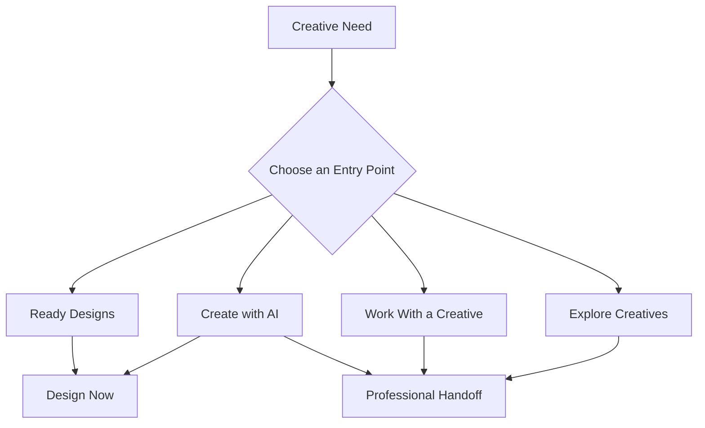
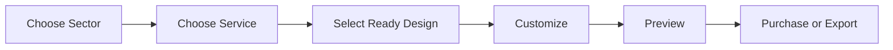
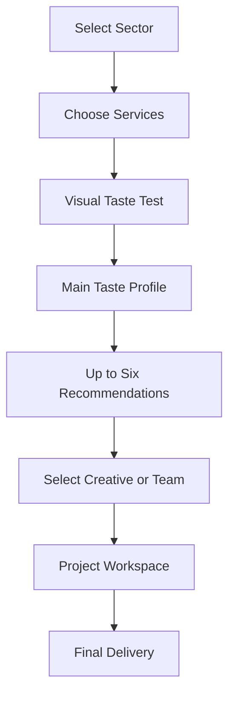
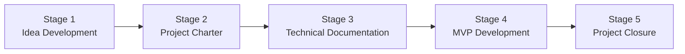

# 🚀 Stage 1: Idea Development Documentation

> **TENTORA** is an AI-powered, curated creative-solutions platform that helps project owners discover, customize, and commission creative work through a clear, sector-led experience.

---

## 1. Idea Brainstorming & Evaluation

During the initial brainstorming stage, several concepts were evaluated based on user value, differentiation, technical feasibility, and scalability.

| Proposed Idea | Strengths | Weaknesses | Decision Logic |
| :--- | :--- | :--- | :--- |
| **Interior Design Platform** | Fast and visually engaging inspiration. | Limited to one creative field and may stop at inspiration. | **Retained as inspiration:** Used as a reference for visual taste discovery. |
| **Creative Solutions Platform — TENTORA** | Connects discovery, customization, taste understanding, matching, and project delivery. | Requires curated content, structured creative data, and reliable matching. | **Selected:** It connects creative discovery to a usable outcome. |
| **Event Management Platform** | Supports detailed planning and coordination. | Too broad and operationally complex for the intended MVP. | **Rejected:** It moves away from the core creative problem. |
| **E-commerce Design Marketplace** | Provides quick access to ready-made creative products. | Often lacks curation, personalization, and custom execution. | **Retained as inspiration:** Used as a reference for Ready Designs. |
| **AI Mood-board Generator** | Creates an engaging visual experience. | Inspiration alone does not guarantee a usable result. | **Retained as a supporting capability.** |

---

## 2. Selected Product Summary: Why TENTORA?

### 🚩 The Problem

Project owners often know they need creative work, but they may not know:

- The correct creative service.
- The most suitable visual direction.
- The right creative professional.
- How to compare different creative options.
- How to manage the project until final delivery.

The current process is fragmented across template libraries, portfolio platforms, freelance marketplaces, messaging tools, and project-management systems.

This makes discovery, comparison, collaboration, and delivery unnecessarily difficult.

### 💡 The Solution

TENTORA brings creative discovery and execution into one curated experience.

It begins with the client’s **sector and creative need**, then provides three clear ways to continue:

- **Ready Designs** — browse and customize editable designs created by approved creatives.
- **Create with AI** — describe a need and receive relevant templates, structured starting points, or a recommended next step.
- **Work With a Creative** — discover a visual taste profile and connect with a suitable creative, studio, or team.

Users may also choose **Explore Creatives** to browse portfolios and creative profiles directly.

### ⚙️ The Product Logic

The customer sees several simple entry points, while the platform organizes fulfillment through two connected paths:

| Product Path | Intended Outcome |
| :--- | :--- |
| **Design Now** | A fast, editable, ready-to-use creative result. |
| **Work With a Creative** | An original or professionally developed creative solution. |

### 🌟 Potential Impact

#### For Clients

- Faster access to relevant creative services.
- Immediate design options for urgent needs.
- Easier understanding of creative choices.
- Better creative and studio recommendations.
- One coherent direction across multiple services.
- Organized collaboration until final delivery.

#### For Creatives

- Better visibility within relevant sectors.
- More suitable project opportunities.
- Recurring revenue from Ready Design licenses.
- Protected attribution, ownership, and permissions.
- Opportunities to convert template users into customization clients.

#### For TENTORA

- A scalable creative marketplace.
- Structured data about client needs and preferences.
- Continuous improvement of discovery and matching.
- A foundation for future AI-assisted creative services.

---

## 3. Target Sectors

TENTORA organizes creative discovery around five initial sectors.

Each sector displays relevant services, Ready Designs, portfolios, and creative recommendations.

| Sector | Example Creative Services |
| :--- | :--- |
| **Restaurants & Cafés** | Brand identity, menus, packaging, social media, websites, signage, motion, staff products, and artwork. |
| **Real Estate & Development** | Branding, architectural visualization, brochures, campaigns, signage, property marketing, and digital experiences. |
| **Events & Occasions** | Event identity, invitations, decorative concepts, photography, signage, and motion content. |
| **Exhibitions & Conferences** | Exhibition identity, booth graphics, presentation materials, signage, digital screens, and print materials. |
| **E-commerce** | Brand identity, packaging, product photography, storefront interfaces, campaigns, and digital advertising. |

> [!NOTE]
> All five sectors will be visible and clickable in the prototype.  
> **Restaurants & Cafés** will be the first complete end-to-end functional pilot.

---

## 4. Core Product Experience

### 🎨 Ready Designs

Ready Designs are editable creative templates uploaded by approved creatives or studios.

They allow clients to reach a usable result without beginning a full commissioned project.

Each design should clearly display:

- Design preview.
- Design title.
- Service category.
- Original creator or studio.
- Price.
- Editable and locked properties.
- Included output formats.
- Commercial license summary.
- Permitted AI-assisted actions.
- Save or favorite action.

#### Example

`Restaurants & Cafés → Menus → Select Design → Add Items and Prices → Preview → Purchase or Export`

Depending on the design and its license, editable properties may include:

- Text and content.
- Colors.
- Typefaces.
- Images.
- Approved layout options.
- Dimensions and output formats.
- Logo placement.
- Motion speed and behavior.

---

### ✨ Create with AI

The user describes what they want in plain language.

> **Example Prompt:**  
> Create a modern bilingual menu for a specialty coffee shop in Riyadh.

The AI interprets the request and identifies:

- Sector.
- Required service.
- Visual style.
- Format.
- Language.
- Likely next action.

It may then:

- Recommend relevant Ready Designs.
- Suggest a suitable service.
- Prepare a structured starting point.
- Recommend working with a creative.

> [!IMPORTANT]
> The first MVP version will focus on **AI-assisted discovery and retrieval**, not unrestricted generation of complete editable designs.

Full AI-generated editable starting points may be introduced later after validating the editor and design schema.

---

### 🤝 Work With a Creative

This path is designed for clients who require an original, professionally developed, or multi-service creative solution.

#### Customer Journey

1. Select a sector.
2. Explore relevant services and creative work.
3. Select one or multiple services.
4. Complete a visual taste test.
5. Receive a reusable **Main Taste Profile**.
6. View up to six recommended creatives, studios, or teams.
7. Select the most suitable option.
8. Begin the project.
9. Manage files, feedback, revisions, and approvals.
10. Receive the final delivery.

The client completes one main visual taste test for the entire project.

The resulting Taste Profile may include:

- Visual style.
- Color preferences.
- Mood.
- Materials and textures.
- Shape language.
- Simplicity or boldness.
- Artistic direction.

A selected service may receive an optional taste refinement without requiring the client to repeat the complete test.

---

### 🔎 Explore Creatives

Users who prefer direct browsing can explore verified creative profiles.

Each profile may include:

- Creative name or studio name.
- Portfolio.
- Services.
- Sector experience.
- Visual style.
- Ready Designs.
- Availability.
- Pricing level.
- Creative DNA.
- Previous project evidence.

---

## 5. Landing Page Direction

The landing page should explain TENTORA quickly and allow visitors to begin without registration or a long questionnaire.

### Primary Navigation

`Ready Designs` · `Create with AI` · `Work With a Creative` · `Explore Creatives` · `How It Works`

### Account Actions

`Sign In` · `Get Started` · `EN / AR`

### Sector Navigation

`Restaurants & Cafés` · `Real Estate & Development` · `Events & Occasions` · `Exhibitions & Conferences` · `E-commerce`

### Suggested Hero

> # Find the right design. Your way.
>
> Explore editable templates, create with AI, or work with a creative matched to your taste.

The hero includes a direct prompt field:

> **What would you like to create?**

Quick suggestions may include:

`Menu` · `Brand Identity` · `Packaging` · `Social Media` · `Website`

### Main Landing Page Sections

1. Hero and AI prompt.
2. Three ways to use TENTORA.
3. Explore by sector.
4. Featured Ready Designs.
5. AI discovery demonstration.
6. Selected work by real creatives.
7. Featured creative profiles.
8. How TENTORA works.
9. Taste Discovery preview.
10. Creator recruitment call to action.
11. Trust, licensing, and quality signals.
12. Final call to action and footer.

> [!IMPORTANT]
> The landing page should demonstrate the platform’s value and direct users into the correct journey. It should not contain the complete marketplace, editor, matching flow, or project workspace.

---

## 6. Core Product Components

| Component | Responsibility |
| :--- | :--- |
| **Sector-Based Discovery** | Organizes services, templates, portfolios, and recommendations by sector. |
| **Ready Design Marketplace** | Supports creator uploads, curation, pricing, licensing, purchase, and attribution. |
| **Interactive Editor** | Allows clients to modify only approved properties and preview valid results. |
| **AI Intent Layer** | Interprets client prompts and connects them to templates, services, or creatives. |
| **Taste Engine** | Converts visual choices into a structured Taste Profile. |
| **Creative DNA** | Represents demonstrated style, skills, sector experience, and working preferences. |
| **Matching Engine** | Compares project requirements and client taste with Creative DNA. |
| **Project Workspace** | Connects selection, communication, feedback, approvals, and delivery. |
| **Curation and Quality Review** | Verifies creatives, templates, rights, and output standards. |

---

## 7. Role of Artificial Intelligence

AI supports the TENTORA experience without replacing human creativity or professional judgment.

| Capability | AI Responsibility |
| :--- | :--- |
| **Intent Understanding** | Identify the sector, service, style, format, and likely next action. |
| **Template Discovery** | Retrieve and rank relevant permissioned Ready Designs. |
| **Customization Support** | Assist with approved content, color, image, layout, and format changes. |
| **Visual Taste Extraction** | Interpret the client’s selected images and visual preferences. |
| **Taste Structuring** | Convert client choices into a reusable Taste Profile. |
| **Creative Matching** | Compare project needs and taste with Creative DNA. |
| **Multi-service Consistency** | Identify creatives or teams capable of maintaining one coherent direction. |
| **Professional Handoff** | Convert saved self-service activity into a structured creative brief. |
| **Project Assistance** | Organize feedback, revisions, files, decisions, and next actions. |

> [!NOTE]
> Original authorship, professional craft, and final artistic judgment remain human whenever a creative is involved.

---

## 8. Human Creativity, Ownership & Rights

TENTORA is designed to create value for creatives, not treat their work as unprotected input.

Every Ready Design must define:

- Original creator attribution.
- Source-design ownership.
- Permitted client customization.
- Permitted AI-assisted changes.
- Usage license and output rights.
- Single-sale or repeat-license model.
- Creator compensation or revenue share.
- Changes that require the original creative.

> [!CAUTION]
> TENTORA must not use portfolios or Ready Designs for AI model training without explicit, informed permission and documented terms.

Creatives may generate revenue through:

- Ready Design licenses.
- Paid customization.
- Commissioned creative work.
- Multi-service projects.
- Studio or team projects.

---

## 9. Unique Value Proposition

TENTORA transforms fragmented creative discovery into connected, usable outcomes.

Its differentiation is based on seven principles:

1. Begin with the project sector and required service.
2. Explain creative services through real visual work.
3. Offer creator-made Ready Designs for immediate needs.
4. Allow clients to describe their needs through a direct AI prompt.
5. Use one Main Taste Profile across one or multiple services.
6. Limit recommendations to a small and relevant group of creatives.
7. Move from self-service to professional execution without restarting.

---

## 10. Project Roadmap

### Delivery Stages

| Stage | Focus | Status |
| :--- | :--- | :--- |
| **Stage 1 — Idea Development** | Concept, problem, sectors, product paths, AI role, and product logic. | ✅ Completed |
| **Stage 2 — Project Charter** | Objectives, MVP scope, stakeholders, deliverables, risks, and metrics. | 🔜 Next |
| **Stage 3 — Technical Documentation** | Architecture, database schema, APIs, AI flow, and frontend components. | ⏳ Pending |
| **Stage 4 — MVP Development** | Build and integrate the approved MVP features. | ⏳ Pending |
| **Stage 5 — Project Closure** | Testing, refinement, demonstration, documentation, and handover. | ⏳ Pending |

### Product Phases

| Phase | Proposed Focus |
| :--- | :--- |
| **Phase 1 — MVP** | Five visible sectors, Restaurants & Cafés functional pilot, limited creator-made Ready Designs, basic editing, AI-assisted retrieval, Main Taste Profile, multi-service selection, weighted matching, creative discovery, and a basic workspace. |
| **Phase 2 — Intelligence & Expansion** | More sectors and Ready Designs, stronger AI assistance, uploaded-reference analysis, improved matching, service-level taste refinement, and user dashboards. |
| **Phase 3 — Creative Ecosystem** | Advanced interactive designs, editable AI starting points, team formation, a broader creative marketplace, and 3D integrations. |

> [!WARNING]
> The exact Phase 1 scope must be approved in Stage 2. A complete design editor, AI generation system, marketplace, matching engine, and project workspace should not all be treated as equally mature MVP commitments.

---

## 11. Team Composition & Initial Roles

| Role | Main Responsibilities |
| :--- | :--- |
| **Backend Lead** | APIs, architecture, Ready Design data, matching services, and integrations. |
| **Frontend Lead** | Discovery, editing, Taste Discovery, recommendations, workspace, and responsive UI. |
| **QA Lead** | Journey, editor, recommendation, accessibility, export, and stability testing. |
| **Database Lead / Project Manager** | Relational schema, data integrity, scope, task coordination, and delivery planning. |
| **AI/ML Engineer** | Intent interpretation, taste extraction, Creative DNA, matching, and evaluation. |
| **Creative Curation Lead** | Template quality, portfolio review, attribution, licensing, and creator onboarding. |

> Named team assignments and capacity commitments will be confirmed during Stage 2.

---

## 12. Initial Technical Direction

The technologies below are initial candidates and will be validated during Stage 3.

| Area | Initial Direction |
| :--- | :--- |
| **Web Application** | Next.js / React |
| **Styling** | Tailwind CSS or a controlled design system |
| **Database** | PostgreSQL |
| **Authentication** | Managed authentication or standards-based sessions |
| **Asset Storage** | Permission-controlled object storage |
| **Initial Matching** | Weighted tags and cosine similarity |
| **AI Prompt Interpretation** | Structured extraction of sector, service, style, format, and intent |
| **Interactive Editing** | Schema-controlled text, image, color, and layout properties |
| **Rendering** | DOM/SVG, Canvas, or a specialist editor SDK |
| **Initial Export** | Image and PDF formats |
| **Prototyping** | Figma |
| **Version Control** | Git and GitHub |
| **Project Management** | GitHub Projects / Notion |
| **Communication** | Slack / Zoom |

---

## 13. Initial Success Measures

The following measures are initial hypotheses and must be validated during Stage 2.

| Area | Provisional Measure |
| :--- | :--- |
| **Entry Clarity** | Users understand Ready Designs, Create with AI, and Work With a Creative without assistance. |
| **Sector Discovery** | Users reach a relevant service or design without registration. |
| **Ready Design Usability** | Users identify editable properties and complete a valid result without specialist knowledge. |
| **AI Discovery Relevance** | Prompt results contain relevant templates, services, or next actions. |
| **Taste Discovery Speed** | The visual taste test can be completed in under three minutes. |
| **Recommendation Set** | No more than six creative, studio, or team options are displayed. |
| **Creative Handoff** | Saved work transfers to a creative without requiring duplicate information. |

---

## 14. Initial Risks & Mitigation

| Risk | Impact | Initial Mitigation |
| :--- | :---: | :--- |
| MVP expands across too many capabilities. | High | Approve a narrow pilot and explicit exclusions in Stage 2. |
| The interactive editor becomes too complex. | High | Begin with a controlled property schema and limited output formats. |
| Full AI-generated editable templates are unreliable. | High | Begin with AI-powered retrieval and structured starting points. |
| Limited curated creative supply. | High | Onboard a controlled set of permissioned creatives and templates. |
| Inaccurate taste or matching results. | High | Use transparent weighted tags, controlled testing, and human review. |
| Multi-service matching becomes complex. | High | Prioritize multidisciplinary studios and treat compatible teams as one recommendation. |
| Ownership or licensing disputes. | High | Store attribution, ownership, permissions, license, and compensation for every design. |
| Unauthorized AI model training. | High | Require explicit permission and documented terms. |
| Navigation becomes crowded. | Medium | Separate primary product navigation from sector navigation. |
| Low creative adoption. | Medium | Offer licensing revenue, attribution, quality exposure, and relevant opportunities. |

---

## 15. Stage 1 Decisions

The following product decisions are approved as the Stage 1 baseline:

- TENTORA will organize discovery through five initial sectors.
- All five sectors will be visible and clickable in the prototype.
- **Restaurants & Cafés** will be the first complete functional pilot.
- The public experience will offer **Ready Designs**, **Create with AI**, and **Work With a Creative** as direct entry points.
- **Explore Creatives** will remain available for direct portfolio browsing.
- The underlying fulfillment model will use two connected paths: **Design Now** and **Work With a Creative**.
- Ready Designs will be created by approved creatives and studios.
- Every design will include clear attribution, licensing, permissions, and compensation.
- Design Now will begin with a structured Ready Design or an AI-assisted discovery result.
- The MVP AI experience will prioritize retrieval and recommendation before full editable-design generation.
- Every custom project will use one Main Taste Profile by default.
- A selected service may receive an optional taste refinement.
- Recommendations will be limited to six creatives, studios, or teams.
- Self-service work can move into professional execution without restarting.
- AI will support discovery and execution while human creators retain authorship and professional judgment.

---

## 16. Items to Confirm in Stage 2

The following items require formal approval during Stage 2:

- Exact Phase 1 MVP scope.
- Explicit MVP exclusions.
- Pilot services and Ready Design formats.
- Definition and limits of Create with AI.
- Creator onboarding and review process.
- Pricing, revenue share, and licensing model.
- Named stakeholders and team assignments.
- Project deliverables and acceptance criteria.
- Validated success metrics.
- Delivery schedule.
- Budget boundaries.
- Governance and decision rights.
- Intellectual-property structure.

---

## 17. Stage 1 Completion

Stage 1 is complete when the product sponsor and core team approve this concept and authorize Stage 2 to convert it into a measurable and technically bounded Project Charter.

> **Next:** Stage 2 will define the approved MVP scope, explicit exclusions, stakeholders, deliverables, schedule, risks, and success measures.
