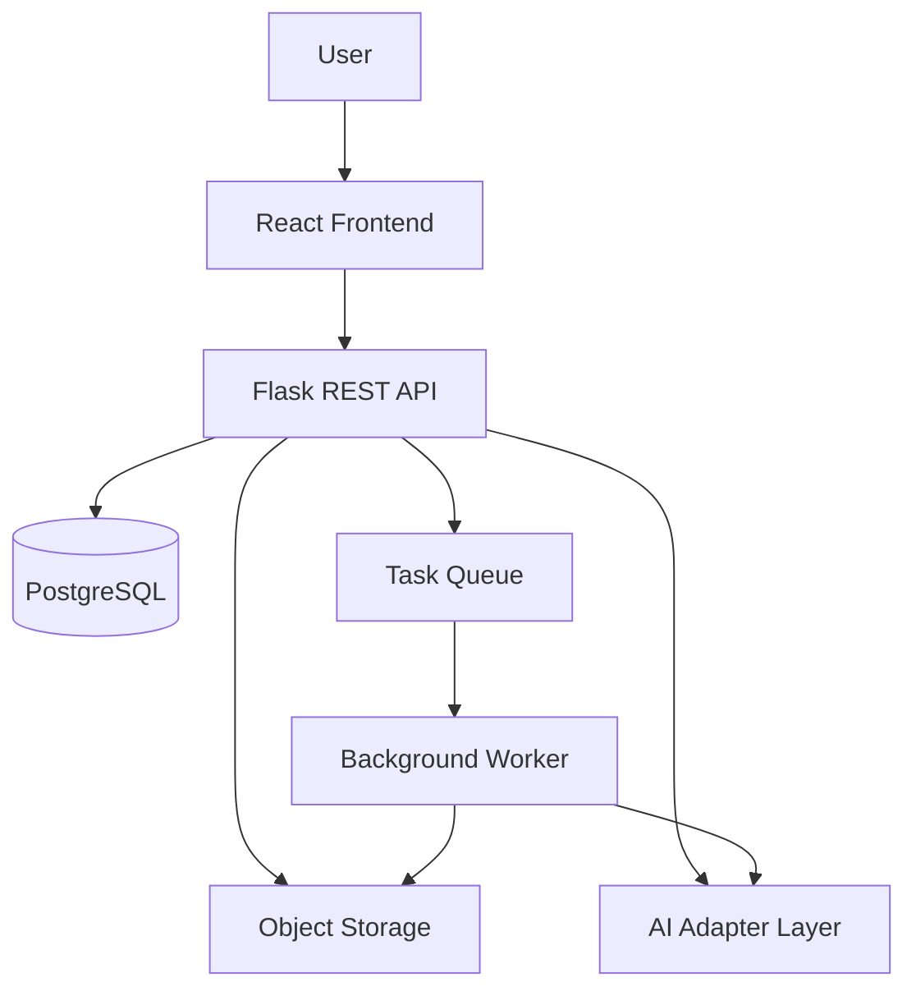
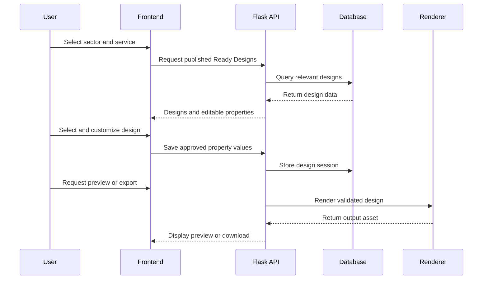
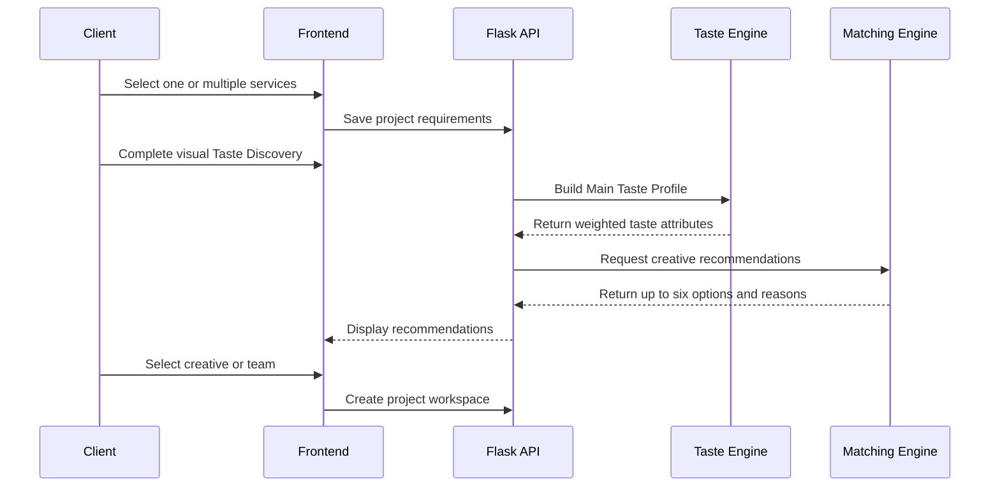
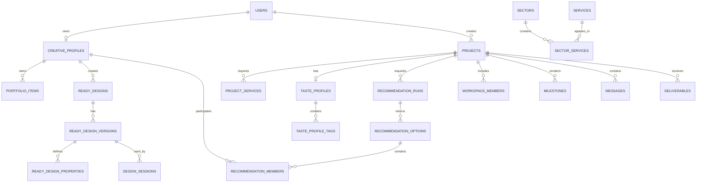
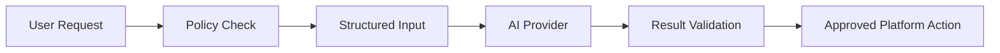
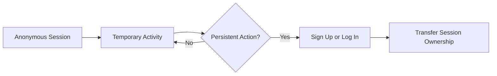

# 🧩 Stage 3: Technical Documentation – TENTORA

## 1. Document Purpose

This document converts the approved TENTORA concept and Project Charter into a technical plan for MVP development.

It defines:

- System architecture.
- Frontend and backend structure.
- Core application modules.
- User roles and permissions.
- Main system flows.
- Database entities and relationships.
- Ready Design editor model.
- Taste Profile and Creative DNA structures.
- Creative matching logic.
- Artificial intelligence responsibilities.
- API specifications.
- Security and authentication.
- Testing and deployment strategies.

> [!IMPORTANT]
> This document replaces the previous interior-design execution architecture based on homeowners, execution plans, providers, and offers.
>
> TENTORA is now structured around sectors, services, Ready Designs, visual taste, creatives, recommendations, and creative project workspaces.

---

## 2. Approved Product Scope

TENTORA provides one shared sector-led entry experience and two connected product paths.

### Shared Entry

`Select Sector → Explore Service → Choose Product Path`

### Path A — Design Now

`Sector → Service → Ready Design → Customize → Preview → Save or Export`

### Path B — Work With a Creative

`Sector → Select Services → Taste Discovery → Main Taste Profile → Creative Matching → Select Creative → Workspace → Delivery`

### Connected Handoff

`Saved Ready Design → Continue With a Creative → Transfer Design Context → Professional Development`

### Approved Sectors

| # | Sector |
| :---: | :--- |
| 1 | **Restaurants & Cafés** |
| 2 | **Real Estate & Development** |
| 3 | **Events & Occasions** |
| 4 | **Exhibitions & Conferences** |
| 5 | **E-commerce** |

> [!NOTE]
> All five sectors will be visible and clickable. **Restaurants & Cafés** will be the first complete end-to-end functional pilot.

---

## 3. Core Features

### 1️⃣ Sector-Based Discovery

- Displays the five approved sectors.
- Shows relevant services after sector selection.
- Presents Ready Designs and creative work directly.
- Allows exploration without initial registration.

### 2️⃣ Ready Designs

- Displays editable designs created by approved creatives.
- Organizes designs by sector and service.
- Shows creator attribution and license information.
- Allows only approved properties to be customized.
- Supports preview, save, and export.

### 3️⃣ Create with AI

- Accepts a natural-language user request.
- Detects the likely sector and service.
- Extracts style, format, language, and content requirements.
- Recommends relevant Ready Designs.
- Suggests a suitable creative path when necessary.

### 4️⃣ Taste Discovery

- Displays curated visual choices.
- Records selected, rejected, or skipped images.
- Converts visual preferences into one Main Taste Profile.
- Reuses the same profile across multiple selected services.
- Supports an optional service-specific taste refinement.

### 5️⃣ Creative Matching

- Matches project requirements with Creative DNA.
- Considers services, sector experience, style, and portfolio evidence.
- Returns no more than six recommendations.
- Explains the main reasons behind each recommendation.

### 6️⃣ Explore Creatives

- Displays verified creative profiles.
- Shows portfolio work.
- Displays services and sector experience.
- Shows Creative DNA and Ready Designs where available.

### 7️⃣ Project Workspace

- Stores the project summary.
- Supports project messages and files.
- Stores references and feedback.
- Tracks milestones and responsibilities.
- Tracks deliverables and project status.

### 8️⃣ Design-to-Creative Handoff

- Transfers the selected Ready Design.
- Transfers user content and uploaded assets.
- Preserves saved customization values.
- Records AI-assisted actions.
- Creates a structured brief for professional development.

---

## 4. User Stories – MoSCoW Method

| Priority | User Role | User Story |
| :--- | :--- | :--- |
| **Must Have** | Visitor | As a visitor, I want to browse sectors, services, and designs without registering so that I can understand the platform quickly. |
| **Must Have** | Client | As a client, I want to select a sector and service so that I can view relevant creative work. |
| **Must Have** | Client | As a client, I want to customize a Ready Design so that I can produce a fast creative result. |
| **Must Have** | Client | As a client, I want to describe my need through an AI prompt so that I can find relevant templates or creatives. |
| **Must Have** | Client | As a client, I want to complete a visual taste test so that the platform can understand my preferences. |
| **Must Have** | Client | As a client, I want to receive no more than six relevant recommendations so that I can compare focused options. |
| **Must Have** | Client | As a client, I want to view creative portfolios before selecting a professional. |
| **Must Have** | Creative | As a creative, I want my work, attribution, permissions, and license information to remain protected. |
| **Must Have** | Curator | As a curator, I want to review profiles and Ready Designs before publication. |
| **Should Have** | Client | As a client, I want to save a Ready Design and continue later. |
| **Should Have** | Client | As a client, I want to transfer my customized design to a professional creative. |
| **Should Have** | Creative | As a creative, I want to receive a structured project brief containing the client’s existing choices. |
| **Should Have** | Client | As a client, I want to manage messages, files, feedback, and milestones in one workspace. |
| **Could Have** | Client | As a client, I want AI to suggest suitable colors and content adjustments. |
| **Could Have** | Client | As a client, I want to compare saved creatives before making a selection. |
| **Won’t Have – MVP** | Client | As a client, I want AI to generate a complete editable design from an empty canvas. |
| **Won’t Have – MVP** | All Users | As a user, I want real-time collaborative design editing. |
| **Won’t Have – MVP** | All Users | As a user, I want advanced 3D or motion editing. |
| **Won’t Have – MVP** | All Users | As a user, I want native iOS and Android applications. |

---

## 5. System Architecture

The MVP will use a **modular monolith architecture**.

This approach is easier to develop, test, and deploy than microservices while preserving clear module boundaries for future expansion.

### Recommended Technology Stack

| Layer | Technology |
| :--- | :--- |
| **Frontend** | React |
| **Backend** | Flask / Python |
| **API Style** | RESTful API |
| **Database** | PostgreSQL |
| **ORM** | SQLAlchemy |
| **Authentication** | JWT or secure token-based sessions |
| **File Storage** | Object storage |
| **Background Processing** | Task queue and background worker |
| **API Documentation** | Swagger / OpenAPI |
| **Version Control** | Git and GitHub |
| **Prototyping** | Figma |

### Architecture Diagram



---

## 6. Architectural Layers

### 1. Presentation Layer

Built with **React** and responsible for:

- Sector and service discovery.
- Ready Design browsing.
- Interactive customization.
- AI prompt entry.
- Taste Discovery.
- Creative recommendations.
- Creative profiles.
- Project workspace.
- Responsive layouts.

### 2. API Layer

Built with **Flask REST API** and responsible for:

- Request validation.
- Authentication.
- Authorization.
- Response serialization.
- Pagination.
- API versioning.
- Error handling.

### 3. Application Layer

Coordinates product use cases such as:

- Saving a Ready Design session.
- Creating a Taste Profile.
- Running creative matching.
- Starting a professional project.
- Transferring a design into a project.
- Generating previews and exports.

### 4. Domain Layer

Contains the main business rules for:

- Sectors and services.
- Ready Design permissions.
- Taste Profile creation.
- Creative DNA.
- Recommendation limits.
- Project states.
- Creator rights and licenses.

### 5. Data Layer

Responsible for:

- PostgreSQL repositories.
- SQLAlchemy models.
- Database migrations.
- Transactions.
- File and asset references.
- Data integrity.

### 6. Integration Layer

Connects the application to:

- AI providers.
- Object storage.
- Export services.
- Image-processing services.
- Email or notification providers.

### 7. Background Processing Layer

Handles operations such as:

- Design preview rendering.
- Export generation.
- Image processing.
- Background removal.
- Longer AI operations.

---

## 7. Application Modules

| Module | Main Responsibilities |
| :--- | :--- |
| **Identity** | Users, roles, authentication, anonymous sessions, and profile ownership. |
| **Catalogue** | Sectors, services, tags, examples, and discovery ordering. |
| **Creatives** | Profiles, portfolios, services, Creative DNA, and availability. |
| **Ready Designs** | Design definitions, versions, editable properties, licenses, and publication. |
| **Design Sessions** | Client edits, uploads, previews, saves, exports, and handoff snapshots. |
| **Taste** | Visual test items, selections, Main Taste Profiles, and service refinements. |
| **Matching** | Candidate filtering, scoring, explanations, and recommendation sets. |
| **Projects** | Selected services, project requirements, creative selection, and lifecycle. |
| **Workspace** | Members, milestones, messages, files, feedback, and deliverables. |
| **AI Orchestration** | AI providers, approved actions, policy checks, and result validation. |
| **Administration** | Curation, publication, rights review, tags, matching rules, and moderation. |
| **Analytics** | Journey events, editor activity, matching feedback, and success metrics. |

---

## 8. User Roles & Permissions

### User Roles

| Role | Description |
| :--- | :--- |
| **Anonymous Visitor** | Browses sectors, services, public work, and Ready Designs. |
| **Client** | Saves designs, completes Taste Discovery, receives recommendations, and owns projects. |
| **Creative** | Manages an approved profile, portfolio, services, and Ready Designs. |
| **Curator** | Reviews creatives, portfolios, Ready Designs, rights, and publication quality. |
| **Project Coordinator** | Supports project milestones, responsibilities, and delivery. |
| **Administrator** | Manages roles, configuration, moderation, and system operations. |

### Permission Matrix

| Action | Visitor | Client | Creative | Curator | Admin |
| :--- | :---: | :---: | :---: | :---: | :---: |
| Browse sectors and public work | ✅ | ✅ | ✅ | ✅ | ✅ |
| Start a temporary design session | ✅ | ✅ | ✅ | ✅ | ✅ |
| Save or export a design | Login Required | ✅ | Own Work | Review | ✅ |
| Complete a temporary taste test | ✅ | ✅ | ❌ | Review | ✅ |
| Save a Taste Profile | Login Required | ✅ | ❌ | Review | ✅ |
| View recommendations | Limited Preview | ✅ | ❌ | Review | ✅ |
| Edit a creative profile | ❌ | ❌ | Own Profile | Review | ✅ |
| Submit a Ready Design | ❌ | ❌ | ✅ | Review | ✅ |
| Publish a Ready Design | ❌ | ❌ | ❌ | ✅ | ✅ |
| Access a project workspace | ❌ | Member | Member | Assigned | ✅ |

> Authorization must always be enforced by the backend, not only hidden in the frontend.

---

## 9. Core System Flows

### Design Now Flow



### Work With a Creative Flow



### Design-to-Creative Handoff

The handoff stores an immutable snapshot containing:

- Ready Design ID and version.
- Current property values.
- Client content.
- Uploaded assets.
- Preview references.
- AI-assisted actions.
- Creator and license references.
- Summary of the client’s editing choices.

The original Ready Design remains unchanged.

---

## 10. Data Flow

1. **Sector Selection**
   - The user selects one of the five approved sectors.

2. **Service Discovery**
   - The frontend requests relevant services, Ready Designs, and creative work.

3. **Path Selection**
   - The user chooses Design Now, Create with AI, or Work With a Creative.

4. **Design Session**
   - Approved customization values are validated and stored.

5. **Taste Discovery**
   - Visual selections are recorded and converted into weighted taste attributes.

6. **Creative Matching**
   - Project requirements and Taste Profile are compared with Creative DNA.

7. **Recommendation**
   - The system returns up to six options with clear recommendation reasons.

8. **Creative Selection**
   - The selected creative, studio, or team becomes connected to the project.

9. **Workspace Creation**
   - Project information, files, references, feedback, and milestones are stored.

10. **Delivery**
    - Final deliverables are submitted, reviewed, and approved.

---

## 11. Main Frontend Components

| Component | Description |
| :--- | :--- |
| **App** | Root component that manages the main application structure. |
| **Navbar** | Displays main product navigation and account actions. |
| **SectorNavigation** | Displays the five approved sectors. |
| **SectorPage** | Shows services, designs, and creative work for one sector. |
| **ServiceFilters** | Filters designs and work by service type. |
| **ReadyDesignGrid** | Displays relevant Ready Design cards. |
| **ReadyDesignCard** | Shows preview, title, creator, price, and license summary. |
| **DesignEditor** | Loads and edits approved design properties. |
| **PropertyControl** | Displays the correct control for text, color, image, font, or layout. |
| **DesignPreview** | Displays the current rendered design. |
| **AIPromptInput** | Accepts and submits natural-language creative requests. |
| **TasteDiscovery** | Displays visual choices and records user selections. |
| **TasteProfileView** | Displays the generated Main Taste Profile. |
| **CreativeMatches** | Displays up to six recommendation options. |
| **RecommendationCard** | Shows creative information and recommendation reasons. |
| **CreativeProfile** | Displays portfolio, services, Creative DNA, and Ready Designs. |
| **ProjectWorkspace** | Manages project files, messages, milestones, and delivery. |
| **AuthenticationModal** | Requests registration only when persistent identity is required. |

---

## 12. Main Backend Classes

| Class / Service | Main Attributes | Main Methods |
| :--- | :--- | :--- |
| **User** | `id`, `email`, `role`, `status` | `register()`, `login()`, `update_profile()` |
| **Sector** | `id`, `slug`, `name`, `status` | `get_services()`, `list_designs()` |
| **Service** | `id`, `name`, `description`, `status` | `get_creatives()`, `get_designs()` |
| **CreativeProfile** | `id`, `user_id`, `bio`, `pricing_level`, `review_status` | `submit_profile()`, `update_portfolio()` |
| **ReadyDesign** | `id`, `creator_id`, `service_id`, `title`, `status` | `publish()`, `create_version()` |
| **DesignSession** | `id`, `user_id`, `design_version_id`, `status` | `update_values()`, `save()`, `request_export()` |
| **TasteSession** | `id`, `project_id`, `test_id`, `status` | `record_selection()`, `complete_test()` |
| **TasteProfile** | `id`, `project_id`, `version`, `status` | `calculate_profile()`, `get_tags()` |
| **CreativeDNA** | `id`, `creative_id`, `version`, `status` | `calculate_dna()`, `get_attributes()` |
| **MatchingService** | Algorithm logic | `filter_candidates()`, `calculate_score()`, `recommend()` |
| **Project** | `id`, `client_id`, `sector_id`, `status` | `add_service()`, `select_creative()`, `start_workspace()` |
| **WorkspaceService** | Project collaboration logic | `add_member()`, `add_file()`, `create_milestone()` |
| **AIService** | Provider-independent AI logic | `interpret_prompt()`, `suggest_designs()`, `validate_action()` |
| **AuthService** | Authentication logic | `hash_password()`, `verify_password()`, `create_token()` |

---

## 13. Database Design

### Main Tables

The database is organized into the following groups:

#### Identity & Catalogue

- `users`
- `client_profiles`
- `creative_profiles`
- `sectors`
- `services`
- `sector_services`

#### Creative Portfolios

- `portfolio_items`
- `portfolio_item_services`
- `style_tags`
- `portfolio_item_tags`
- `creative_dna`
- `creative_dna_tags`

#### Ready Designs

- `ready_designs`
- `ready_design_versions`
- `ready_design_properties`
- `ready_design_licenses`
- `design_sessions`
- `design_session_values`
- `design_exports`
- `design_handoff_snapshots`

#### Projects & Taste

- `projects`
- `project_services`
- `taste_tests`
- `taste_test_items`
- `taste_selections`
- `taste_profiles`
- `taste_profile_tags`
- `service_taste_directions`

#### Recommendations

- `recommendation_runs`
- `recommendation_options`
- `recommendation_members`
- `recommendation_feedback`

#### Workspace

- `workspace_members`
- `milestones`
- `messages`
- `assets`
- `feedback_items`
- `deliverables`

---

## 14. Database Relationships

### Relationship Summary

- One sector can contain many services.
- One service can appear in many sectors.
- One creative can own many portfolio items.
- One creative can publish multiple Ready Designs.
- One Ready Design can have multiple immutable versions.
- One design version can contain multiple editable properties.
- One client can create multiple projects.
- One project can contain multiple services.
- One project has one Main Taste Profile.
- One Taste Profile contains multiple weighted style tags.
- One recommendation run returns multiple recommendation options.
- One recommendation option can contain one creative, studio, or team.
- One project can contain multiple workspace members, messages, milestones, and deliverables.

### ER Diagram



---

## 15. Ready Design Technical Model

A Ready Design is not stored as a flat image only.

It contains:

- A design version.
- A renderer type.
- Canvas dimensions.
- Editable properties.
- Locked properties.
- Validation constraints.
- AI permissions.
- Supported export formats.
- Creator and license information.

### Supported Property Types

- `text`
- `number`
- `boolean`
- `color`
- `font_choice`
- `image_asset`
- `enum`
- `layout_variant`
- `dimension`
- `repeater`

### Example Ready Design Definition

```json
{
  "renderer_type": "svg-template",
  "canvas": {
    "width": 1080,
    "height": 1350
  },
  "properties": [
    {
      "key": "brand_name",
      "type": "text",
      "default": "Your Brand",
      "constraints": {
        "max_length": 40
      },
      "ai_policy": "rewrite_only"
    },
    {
      "key": "accent_color",
      "type": "color",
      "default": "#D75B39",
      "constraints": {
        "allowed_mode": "hex"
      },
      "ai_policy": "suggest"
    },
    {
      "key": "hero_image",
      "type": "image_asset",
      "constraints": {
        "max_mb": 10,
        "aspect_ratio": "4:5"
      },
      "ai_policy": "background_removal_allowed"
    }
  ],
  "exports": ["png"]
}
```

### Versioning Rules

- Published Ready Design versions are immutable.
- Creator changes produce a new version.
- Existing sessions remain connected to their original version.
- Exports and handoffs record the exact version.
- Unpublishing a design does not delete historical sessions or licenses.

---

## 16. Taste Engine

Each Taste Discovery image contains reviewed weighted style tags.

Possible user actions include:

- Select.
- Reject.
- Skip.
- Strong preference.

### Initial Profile Calculation

```text
raw_weight(tag) =
Σ selection_value(image) × image_tag_weight(image, tag)

profile_weight(tag) =
normalize(raw_weight(tag))
```

Where:

- Selected images provide a positive value.
- Rejected images may provide a controlled negative value.
- Skipped images provide zero.
- The final results are normalized into a stable comparison range.

The calculation weights must be configurable and versioned.

### Service-Specific Direction

```text
effective_service_taste =
main_taste_profile + service_direction_adjustment
```

This allows one service to receive a small refinement without repeating the complete Taste Discovery experience.

---

## 17. Creative DNA

Creative DNA is a structured representation of a creative’s demonstrated style and capabilities.

It may include:

- Approved portfolio tags.
- Services demonstrated in portfolio work.
- Sector experience.
- Visual style attributes.
- Multidisciplinary capabilities.
- Studio or team capabilities.
- Project scale.
- Pricing level.
- Availability when collected.

### Curation States

| State | Meaning |
| :--- | :--- |
| **Draft** | The creative is preparing the profile. |
| **Submitted** | The profile is awaiting review. |
| **Changes Requested** | Additional evidence or corrections are required. |
| **Approved** | The profile may appear in discovery and matching. |
| **Suspended** | The profile is temporarily hidden. |

Only approved Creative DNA can participate in client recommendations.

---

## 18. Matching Logic

### Candidate Filtering

A creative is removed before scoring when:

- The profile is not approved.
- The creative does not provide any selected service.
- Required portfolio evidence is missing.
- The profile is suspended or hidden.

### Initial Match Score

```text
match_score =
0.50 × taste_similarity +
0.30 × service_coverage +
0.15 × sector_relevance +
0.05 × portfolio_evidence
```

The weights are initial configurable values and must be validated through testing.

### Team Recommendation Score

```text
team_score =
0.40 × project_taste_fit +
0.30 × service_coverage +
0.20 × member_coherence +
0.10 × sector_relevance
```

### Recommendation Rules

- Return no more than six options.
- One option may represent a creative, studio, or compatible team.
- Avoid displaying nearly identical recommendations.
- Include understandable reasons for every option.
- Do not use price or location as mandatory filters unless the client selects them.

### Example Explanation

> Recommended because the creative demonstrates strong minimalist and editorial characteristics, covers Brand Identity and Menu Design, and has relevant Restaurants & Cafés experience.

---

## 19. Artificial Intelligence Architecture

### AI Responsibilities

| Capability | AI Responsibility |
| :--- | :--- |
| **Prompt Interpretation** | Extract sector, service, style, format, language, and intent. |
| **Template Retrieval** | Find and rank relevant permissioned Ready Designs. |
| **Text Assistance** | Rewrite or translate content within approved limits. |
| **Color Assistance** | Suggest colors compatible with brand inputs. |
| **Image Assistance** | Remove backgrounds or adapt approved images. |
| **Taste Support** | Help interpret visual preference signals. |
| **Matching Support** | Compare Taste Profile and Creative DNA. |
| **Professional Handoff** | Generate a structured brief from saved client activity. |

### AI Orchestration Flow



### AI Guardrails

- AI can modify only approved properties.
- AI cannot change locked design elements.
- AI cannot bypass creator license rules.
- AI output must be validated before storage or rendering.
- AI actions must be logged.
- Creative portfolios cannot be used for training without explicit permission.
- Users must be informed when content is AI-assisted.

---

## 20. API Specifications

### Catalogue APIs

| Endpoint | Method | Description |
| :--- | :---: | :--- |
| `/api/sectors` | GET | Return the five active sectors. |
| `/api/sectors/{sectorId}/services` | GET | Return services for a selected sector. |
| `/api/services/{serviceId}` | GET | Return service details and examples. |

### Ready Design APIs

| Endpoint | Method | Description |
| :--- | :---: | :--- |
| `/api/ready-designs` | GET | List published Ready Designs using filters. |
| `/api/ready-designs/{id}` | GET | Return design information and editable properties. |
| `/api/design-sessions` | POST | Start a temporary or authenticated design session. |
| `/api/design-sessions/{id}` | PATCH | Update approved property values. |
| `/api/design-sessions/{id}/preview` | POST | Generate a design preview. |
| `/api/design-sessions/{id}/export` | POST | Request a validated export. |
| `/api/design-sessions/{id}/handoff` | POST | Transfer the design into a professional project. |

### AI Discovery APIs

| Endpoint | Method | Description |
| :--- | :---: | :--- |
| `/api/ai/interpret` | POST | Interpret a natural-language request. |
| `/api/ai/recommend-designs` | POST | Return relevant permissioned Ready Designs. |
| `/api/ai/actions/{action}` | POST | Run one approved AI-assisted action. |

### Taste & Project APIs

| Endpoint | Method | Description |
| :--- | :---: | :--- |
| `/api/projects` | POST | Create a project context. |
| `/api/projects/{id}/services` | POST | Add one or multiple services. |
| `/api/taste-tests/{id}` | GET | Return visual Taste Discovery items. |
| `/api/taste-sessions` | POST | Start a Taste Discovery session. |
| `/api/taste-sessions/{id}/selections` | POST | Save visual selections. |
| `/api/taste-sessions/{id}/complete` | POST | Generate the Main Taste Profile. |
| `/api/projects/{id}/taste-profile` | GET | Return the project Taste Profile. |

### Matching APIs

| Endpoint | Method | Description |
| :--- | :---: | :--- |
| `/api/projects/{id}/recommendations` | POST | Generate up to six recommendations. |
| `/api/recommendations/{id}` | GET | Return recommendation details and reasons. |
| `/api/recommendations/{id}/feedback` | POST | Store save, reject, rating, or selection feedback. |

### Creative APIs

| Endpoint | Method | Description |
| :--- | :---: | :--- |
| `/api/creatives` | GET | List approved creatives using filters. |
| `/api/creatives/{id}` | GET | Return a creative profile and portfolio. |
| `/api/creatives/{id}/ready-designs` | GET | Return the creative’s published designs. |
| `/api/creative/profile` | PATCH | Update the authenticated creative profile. |
| `/api/creative/portfolio` | POST | Submit portfolio work for review. |

### Workspace APIs

| Endpoint | Method | Description |
| :--- | :---: | :--- |
| `/api/projects/{id}/workspace` | GET | Return workspace summary and state. |
| `/api/projects/{id}/messages` | GET / POST | Retrieve or add project messages. |
| `/api/projects/{id}/files` | GET / POST | Retrieve or upload project files. |
| `/api/projects/{id}/milestones` | GET / POST | Retrieve or create milestones. |
| `/api/projects/{id}/feedback` | GET / POST | Retrieve or add feedback. |
| `/api/projects/{id}/deliverables` | GET / POST | Retrieve or submit deliverables. |

---

## 21. Authentication & Progressive Registration

Users can initially:

- Browse sectors.
- Explore services.
- View public creative work.
- Browse Ready Designs.
- Start a temporary design session.
- Begin Taste Discovery.

Authentication becomes required when the user attempts to:

- Save persistent progress.
- Export a design.
- Purchase a license.
- Save a Taste Profile.
- Select a creative.
- Start or join a project workspace.

### Anonymous Session Flow



Temporary data should transfer to the authenticated account without forcing the user to restart.

---

## 22. Files, Assets & Export

### Supported Asset Categories

- Ready Design source assets.
- Design previews.
- User-uploaded images.
- Portfolio media.
- Taste Discovery images.
- Workspace files.
- Final deliverables.
- Exported design files.

### Upload Requirements

- Validate file type.
- Validate file size.
- Generate unique storage keys.
- Store file metadata in PostgreSQL.
- Scan or validate files before use.
- Use permission-controlled access.
- Preserve asset ownership.

### Initial Export Formats

The MVP should begin with controlled two-dimensional formats:

- PNG.
- PDF when required by the pilot design.

Advanced video, motion, web, and 3D exports are outside the initial MVP.

---

## 23. Security, Privacy & Creative Rights

### Security Controls

- Hash passwords using a secure password-hashing algorithm.
- Use secure token expiration.
- Enforce role-based authorization.
- Validate all backend inputs.
- Restrict file types and sizes.
- Use signed or protected file access.
- Rate-limit authentication and AI endpoints.
- Store audit events for sensitive actions.
- Keep credentials outside the source repository.

### Privacy Controls

- Collect only data required for the product journey.
- Separate public portfolio data from private project data.
- Allow users to access or remove eligible personal information.
- Define retention rules for anonymous sessions and uploads.
- Avoid storing unnecessary sensitive information.

### Creative Rights

Every Ready Design must store:

- Original creator.
- Ownership information.
- Editable and locked properties.
- Permitted AI-assisted actions.
- License type.
- Commercial-use rules.
- Compensation or revenue-share terms.
- Output rights.
- Design version.

> [!CAUTION]
> TENTORA must not use portfolios or Ready Designs for AI training without explicit, informed, and documented permission.

---

## 24. Error Handling

### Standard Error Format

```json
{
  "error": {
    "code": "INVALID_PROPERTY_VALUE",
    "message": "The selected value is not permitted for this design.",
    "details": {
      "property": "accent_color"
    }
  }
}
```

### HTTP Status Guidance

| Status | Usage |
| :---: | :--- |
| `200` | Successful request. |
| `201` | Resource created successfully. |
| `400` | Invalid request or validation error. |
| `401` | Authentication required. |
| `403` | User lacks permission. |
| `404` | Requested resource not found. |
| `409` | State or version conflict. |
| `422` | Valid structure but unacceptable business value. |
| `429` | Request limit exceeded. |
| `500` | Unexpected server error. |

---

## 25. SCM & Development Strategy

The project will use Git and GitHub for version control and collaboration.

### Branching Strategy

- **`main`** — stable and production-ready code.
- **`develop`** — integration branch for ongoing development.
- **`feature/*`** — individual feature branches.
- **`fix/*`** — bug-fix branches.
- **`docs/*`** — documentation changes.

### Development Workflow

1. Create a branch for each task.
2. Commit changes using clear messages.
3. Open a Pull Request.
4. Run automated checks.
5. Complete peer review.
6. Merge approved work into `develop`.
7. Test the integrated version.
8. Merge the stable release into `main`.

### Example Branches

- `feature/sector-navigation`
- `feature/ready-design-editor`
- `feature/taste-discovery`
- `feature/creative-matching`
- `feature/project-workspace`
- `fix/anonymous-session-transfer`

### Required Pull Request Checks

- Code formatting.
- Linting.
- Unit tests.
- API tests.
- Database migration validation.
- Build validation.
- No committed credentials.
- Documentation updated when behavior changes.

---

## 26. Quality Assurance Strategy

### Unit Testing

Tests individual functions such as:

- Property validation.
- Taste Profile calculation.
- Matching score calculation.
- Recommendation limit enforcement.
- Permission checks.
- Project-state transitions.

### API Testing

Tests:

- Request and response formats.
- HTTP status codes.
- Authentication.
- Authorization.
- Invalid input handling.
- Pagination and filtering.
- Design-session ownership.
- Workspace access.

### Integration Testing

Tests communication between:

- React frontend and Flask API.
- Flask API and PostgreSQL.
- Design sessions and renderer.
- Taste Engine and Matching Engine.
- Object storage and asset metadata.
- AI providers and validation rules.

### End-to-End Testing

Tests complete journeys such as:

- Sector to Ready Design export.
- AI prompt to relevant design results.
- Taste Discovery to recommendations.
- Creative selection to workspace.
- Anonymous session to authenticated ownership.
- Ready Design to professional handoff.

### Critical Test Scenarios

- All five sectors appear correctly.
- Restaurants & Cafés journey works end to end.
- Only approved design properties can be edited.
- Locked design elements cannot be changed.
- Recommendation results never exceed six.
- Only approved creatives participate in matching.
- Anonymous progress survives registration.
- Handoff data transfers without loss.
- Unauthorized users cannot access private projects.
- Creator attribution and license data remain attached to every design.

---

## 27. Deployment Plan

### Environments

| Environment | Purpose |
| :--- | :--- |
| **Local** | Individual development and debugging. |
| **Test** | Automated testing and database migration checks. |
| **Staging** | Integrated testing and stakeholder review. |
| **Production** | Public approved MVP. |

### Deployment Units

- React frontend.
- Flask REST API.
- PostgreSQL database.
- Object storage.
- Background worker.
- Task queue.
- AI adapter configuration.

### Release Process

1. Merge reviewed work into `develop`.
2. Run automated tests.
3. Deploy to staging.
4. Complete QA and stakeholder review.
5. Resolve critical defects.
6. Merge the approved release into `main`.
7. Deploy to production.
8. Monitor logs, errors, performance, and user journeys.

---

## 28. Implementation Order

### Phase 1 — Technical Foundation

- Repository structure.
- Flask application setup.
- React application setup.
- PostgreSQL connection.
- Database migrations.
- Authentication foundation.
- Error-handling standard.
- Object-storage foundation.

### Phase 2 — Discovery

- Five-sector catalogue.
- Services and filters.
- Sector pages.
- Ready Design grid.
- Explore Creatives.
- Demo-content labels.

### Phase 3 — Restaurants & Cafés Pilot

- Ready Design model.
- Design versioning.
- Editable-property schema.
- Design sessions.
- Preview rendering.
- PNG or PDF export.
- Progressive authentication.

### Phase 4 — Taste & Matching

- Taste Discovery interface.
- Taste Profile calculation.
- Creative DNA.
- Candidate filtering.
- Matching score.
- Recommendation explanations.
- Maximum six-result rule.

### Phase 5 — Professional Projects

- Creative selection.
- Project creation.
- Workspace membership.
- Messages and files.
- Feedback.
- Milestones.
- Deliverables.

### Phase 6 — AI & Handoff

- Prompt interpretation.
- Template retrieval.
- Approved AI actions.
- Result validation.
- Design-to-Creative handoff.
- Structured professional brief.

### Phase 7 — Validation & Release

- Security review.
- Accessibility review.
- Performance testing.
- End-to-end testing.
- Stakeholder demonstration.
- Production release.

---

## 29. Technical Decisions Required Before Stage 4

Before development begins, the team must approve:

- The exact Restaurants & Cafés pilot services.
- The initial Ready Design renderer.
- Supported editable-property types.
- Initial PNG and PDF export requirements.
- Object-storage provider.
- Authentication method.
- AI provider strategy.
- Approved AI-assisted actions.
- Taste Discovery calculation weights.
- Creative DNA classification rules.
- Matching score weights.
- Anonymous-session expiration period.
- File size and format limits.
- Hosting and deployment provider.
- Monitoring and analytics tools.

Material technical decisions should be recorded as **Architecture Decision Records (ADRs)**.

---

## 30. Stage 3 Conclusion

Stage 3 defines the technical foundation required to build the TENTORA MVP.

The proposed architecture uses:

- React for the frontend.
- Flask and Python for the backend.
- PostgreSQL for structured relational data.
- Object storage for design and project assets.
- A controlled Ready Design property model.
- A visual Taste Engine.
- Structured Creative DNA.
- Explainable matching.
- A maximum of six recommendations.
- Progressive authentication.
- Controlled AI assistance.
- A connected project workspace.

The architecture supports all five sectors while limiting the first complete functional implementation to **Restaurants & Cafés**.

> **Next Step:** Stage 4 will implement the approved architecture and build the connected TENTORA MVP.
